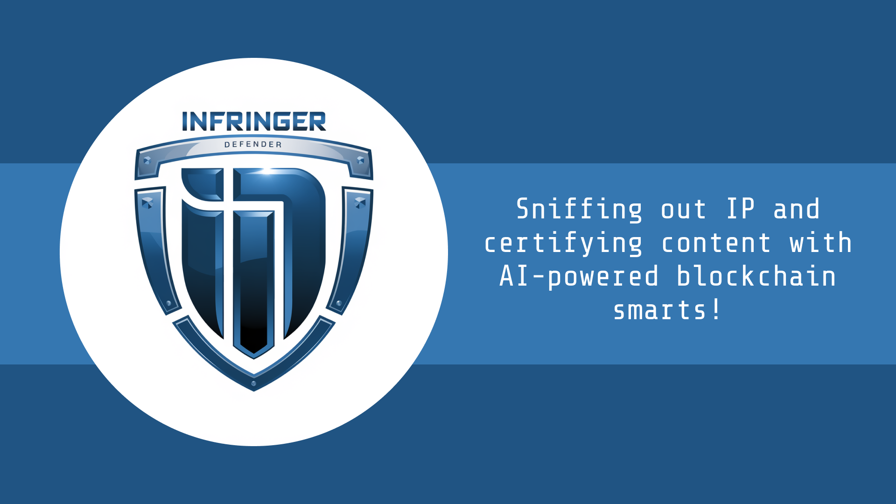

# IP Defender Agent

## Quick Description:
IP Defender Agent is designed to identify and manage intellectual property (IP) rights for online content. It operates across  Twitter and Telegram, as well as on its standalone website. 
Here’s a breakdown of its functions:
1. IP Verification: Users can request the agent to verify the IP of an online image. The agent examines the content for any IP issues, evaluates potential violations, and provides a score indicating the likelihood of an IP infringement. It also offers a description if a violation is detected. If an IP certificate is found, it will return it to the user for them to know more about the IP of that image.
2. Reputation Tracking: Upon verifying content, the agent logs the user's details into the "ReputationContract" and a subgraph. This information helps in building a network graph that categorizes users as infringers or good actors. Over time, as more data is gathered, the agent’s algorithm improves in accurately predicting the likelihood of a user infringing IP rights.
3. IP Certificate Minting: If content is verified and deemed original, users can ask the agent to mint an IP certificate. This certificate includes IP details, an invisible watermark, and Adobe C2PA metadata, all embedded within the content. This helps in establishing and protecting the user's IP ownership in the future.

In essence, IP Defender Agent helps content creators protect their IP rights, monitor the reputation of content users, and secure their content against future infringements.

## Contracts
- Reputation Smart Contract:
  - Base: 0x984B06553b696d813A0D2C4475ba9aF5405EeeEe
- Subgraph:https://api.studio.thegraph.com/query/103698/ip-reputationagent/v0.0.1

## More in Depth:
The IP Defender Agent is developed using Gaia LLM and the Collab.Land AI Agent Starter Kit for multiplatform connectivity (we are live in Telegram and Twitter and our own landing page). 
Users can interact with our agents on Twitter by #ipdefenderagent in a post and asking IP questions, to verify or mint a certificate. Its a very easy and common behavior for the user.  In Telegram you need to talk to our agent in its one app (MentaportBox) and ask the same type of question as in Twitter. Additionally, users can communicate directly with the Defender Agent through a custom chat box on our landing page.

Here’s a breakdown of the agent’s functionalities:
1. IP Verification: Each time a user requests image verification, the agent utilizes Mentaport technology to analyze metadata and watermarks to check for any IP associations. If the content is linked to an IP, the agent retrieves the corresponding certificate and assesses whether the poster is the rightful owner or an infringer. The agent then applies its Infringer/Reputation algorithm, combined with our Gaia model (LLM), to generate a reputation score. This score is recorded in the Reputation Smart Contract, enhancing the agent’s ability to classify users over time.
2. IP Certificate Minting: When a minting request is made, the agent converts the user's handle (on Twitter and Telegram) into a valid address using the Lit protocol and Collab.Land. It then evaluates the user's reputation and the content's authenticity. If approved, the agent mints an IP certificate for the content, which the user can then share as certified.
3. Data Analysis and Tracking: The platform leverages The Graph to create a subgraph of our smart contract. This allows for efficient identification of patterns and connections among users, updating scores with each post, which helps in distinguishing between infringers and legitimate defenders more effectively.

Overall, the IP Defender Agent offers robust tools for managing and safeguarding intellectual property in digital content, fostering a responsible community of content creators and users.

